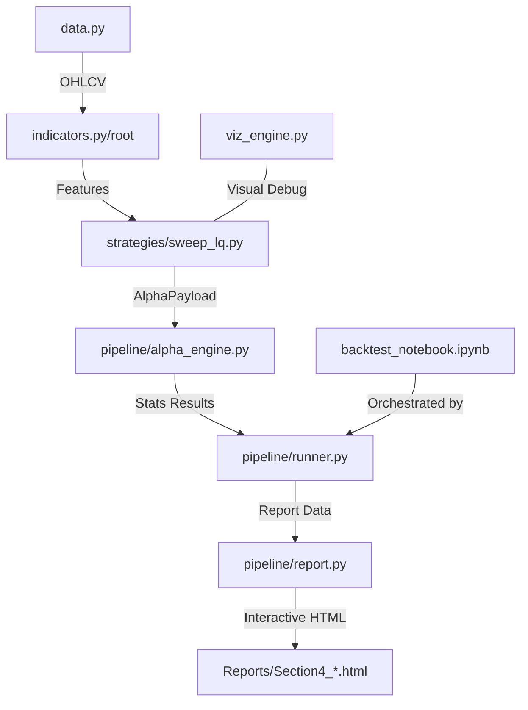

# Project State

## Status: IN PROGRESS
## Current Phase: Section 4 — Statistical Pre-Validation (Alpha Test)

## Research Context (80/20)
- **Assets Pool**: `EURUSD`, `GBPUSD`, `XAUUSD`, `NASDAQ`, `SP500`, `USDJPY`, `USDCAD`, `AUDUSD`.
- **Timeframes**: `1min`, `3min`, `5min`, `15min`, `30min`, `1h`, `4h`, `1D`.
- **Period**: 2020-01-01 to 2023-12-31 data (Aligned Working Set).
- **Active Focus**: `XAUUSD [15min]` / `NASDAQ [15min]` Alpha Validation.

## Blueprint Compliance (Quant R&D Pipeline)
- [x] **Section 1: Audit & Planning** — Modules structured (`pipeline/`, `strategies/`).
- [x] **Section 2: Data Quality** — `data.py` (Joblib Turbo Cache) implemented.
- [x] **Section 3: Feature Engineering** — `indicators.py` + `strategies/` signal logic.
- [/] **Section 4: Statistical Pre-Validation** — `alpha_engine.py` + `report.py` (IN PROGRESS).
- [ ] **Section 5: Strategy Modeling** — Entry/Exit rules implementation pending.
- [ ] **Section 6: Backtest Engine** — VectorBT / Backtrader (Selection pending).
- [ ] **Section 7: OOS Validation** — Walk-forward analysis pending.
- [ ] **Section 8: Robustness** — Monte Carlo & Stress tests pending.
- [ ] **Section 9: Realistic Simulation** — Friction/Slippage simulation pending.
- [ ] **Section 10: Production** — MT4/MT5 bridge & Monitoring pending.

## Project Architecture & Communication Flow

- **Data Layer**: `data.py` provides standardized OHLCV via Joblib/LZ4 cache.
- **Signal Layer**: `indicators.py` (logic) + `strategies/` (execution signals) define the Alpha.
- **Validation Layer**: `pipeline/` (Engine + Runner + Report) handles the 4-step Alpha Test.
- **Visualization**: `viz_engine.py` provides the Bokeh/Matplotlib hybrid debugging cockpit.

## Active Features
- **Turbo Cache Data Pipeline**: High-speed Joblib cache for 8 assets/8 TFs.
- **Statistical Alpha Engine**: Automated 4-step GO/NO GO pipeline (Spearman, MI, KS, Quantile).
- **Interactive HTML Reporting**: Modular reporting system with Chart.js integration.
- **Cockpit Debugger**: Visual signal inspection tool for manual logic verification.

## Accomplishments (Current Phase: Section 4)
- **Engine Refinement**: Integrated Sanity Checks, Spearman ρ, and Signal Detection logic.
- **Visual Integration**: Linked `viz_engine.py` for manual signal inspection in Section 3.
- **Standardization**: Aligned the notebook with the Section 4 statistical pipeline.

## Archive (Previous Phases)
### Section 1-3: Setup & Alpha Definition
- Audit of existing modules and implementation of `data.py`/`indicators.py`.
- Definition of the SweepLQ Alpha hypothesis.

## Roadmap (Immediate)
- [ ] Finalize Section 4 reports for the asset pool.
- [ ] Implement EBTA detrending check in `alpha_engine.py`.
- [ ] Transition to Section 5 Strategy Modeling (Entry/Exit).
